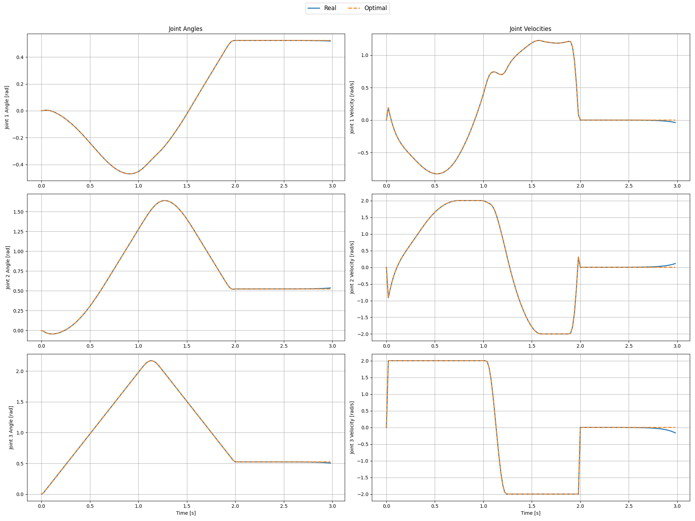
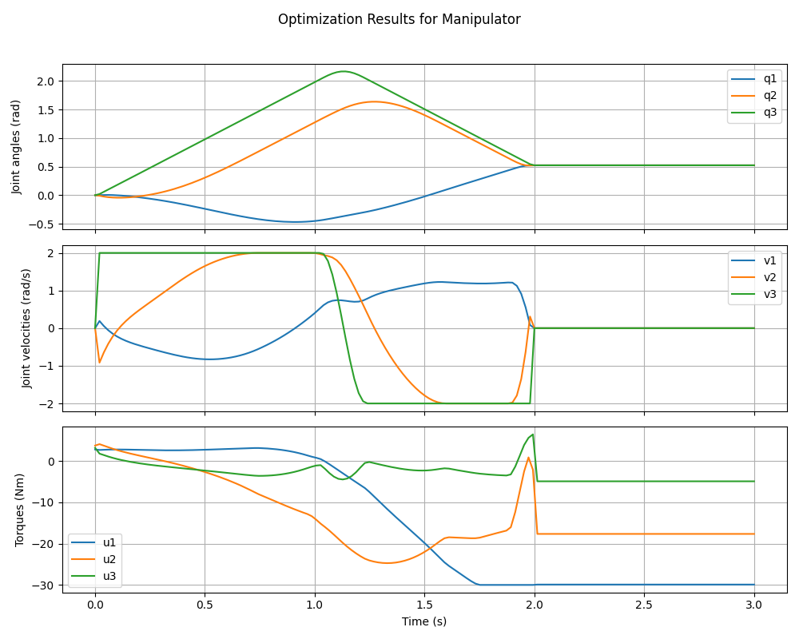
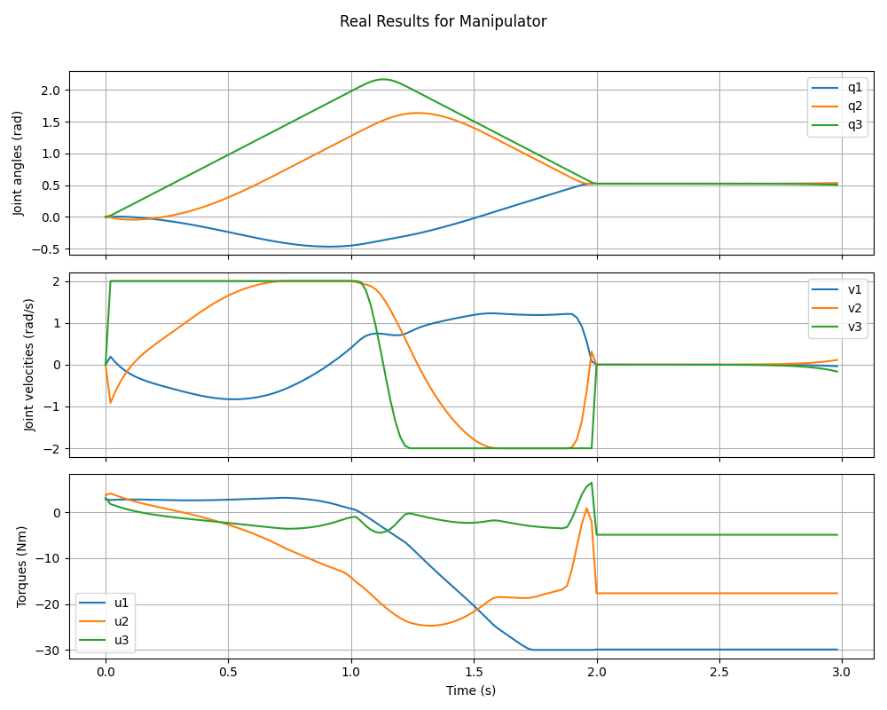
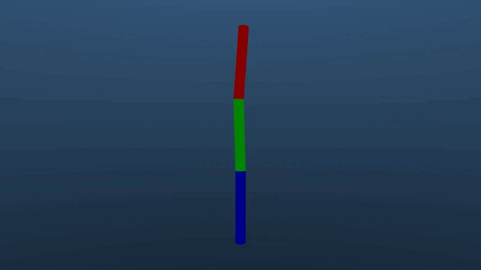
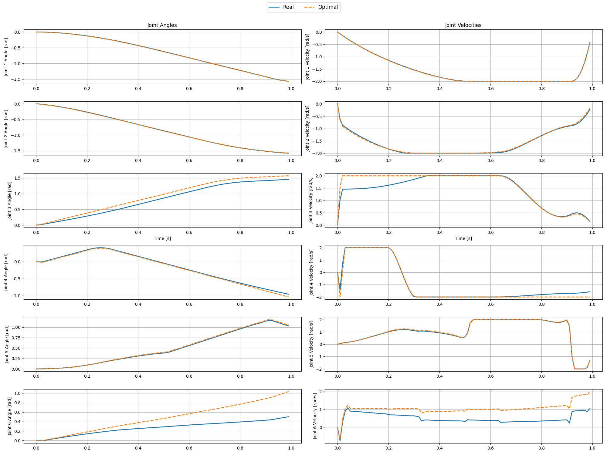
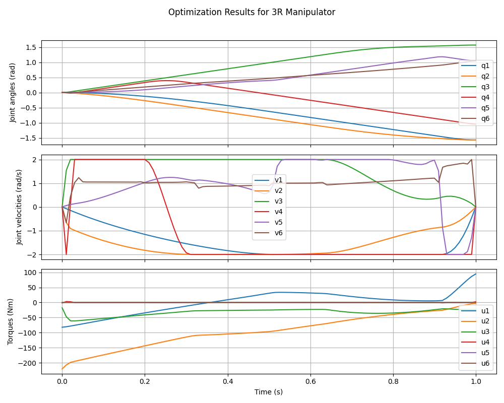
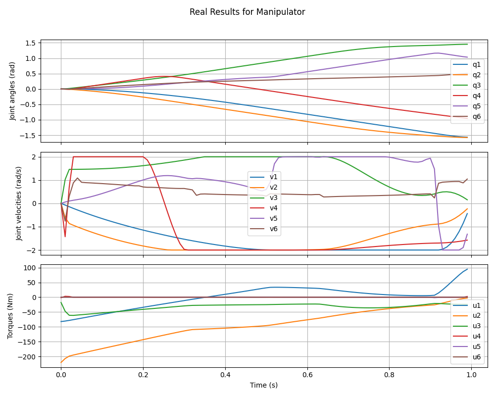
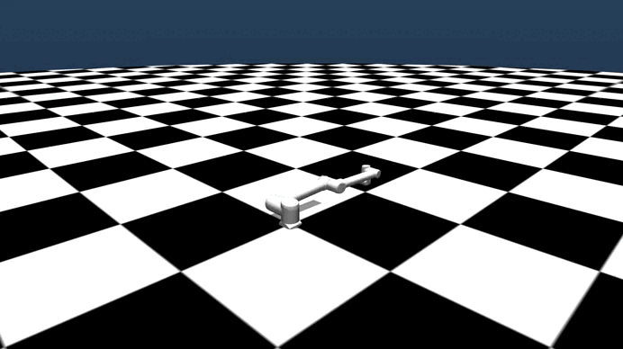

# Задание 1 — Оптимизация траектории манипулятора

Цель задания — найти оптимальную траекторию движения манипулятора из начального состояния в целевую точку, минимизируя сумму квадратов управляющих моментов с учётом ограничений на:

- допустимые углы суставов
- скорости
- управляющие воздействия (моменты)

Всё реализовано средствами **Pinocchio** (для вычисления кинематики и динамики) и **CasADi** (для построения и решения задачи оптимизации). Результат визуализирован в MuJoCo.

---

## Реализованные компоненты

### Класс `TrajOpt` (`trajopt2simulation/trajopt.py`)

- Формирует символическую динамику с использованием `Pinocchio + CasADi`
- Строит задачу оптимизации:
  - переменные: состояния `x`, управления `u`
  - RK4-интеграция системы
  - ограничения на `q`, `v`, `u`
  - целевая функция: энергия + трекинг + терминальный штраф
- Решает задачу через IPOPT и возвращает оптимальную траекторию `q(t)`, `u(t)`

### Класс `Simulator` (`trajopt2simulation/mj_simulator.py`)

- Запускает пошаговую симуляцию траектории в MuJoCo
- Отрисовывает результат
- Сохраняет видео и графики:
  1) `real_results.png` — реальные `q(t)`, `v(t)`, `u(t)`
  2) `optimization_results.png` — оптимизированные траектории
  3) `difference.png` — сравнение оптимизации и симуляции
  4) `vid.mp4` — видео исполнения траектории

---

## Как запустить

### Планарный манипулятор:

```bash
cd first_task
python planar.py
```

### UR10:

```bash
cd first_task
python ur10.py
```

---

## Примеры результатов

### Планарный 3R манипулятор

#### 🔹 Оптимизация vs симуляция (график разницы между оптимальной траектории и реальной)



#### 🔹 Управляющие воздействия и состояния

  


#### 🔹 Видео



---

### UR10 манипулятор

#### 🔹 Оптимизация vs симуляция



#### 🔹 Управляющие воздействия и состояния

  


#### 🔹 Видео



❗️ В случае с UR10 **сферическое запястье не всегда точно приходит к нужным углам**. С чем именно это связано — пока не выяснено, но, по всей видимости, это связано с **внутренними эффектами MuJoCo**, такими как трение, контакты или численные особенности. В `Pinocchio` динамика считается без учёта трения, что может приводить к расхождениям при передаче моментов в симулятор.

---

## Возможное расширение через ROS2

- Ноды для запуска основного кода.
- Передача необходимой точки через `actions` или `service`.
- Оптимизированную траекторию можно публиковать в топик `JointTrajectory` через сообщение `trajectory_msgs/JointTrajectory`.
- Визуализация в `Rviz` и Gazebo (Ignition).

---