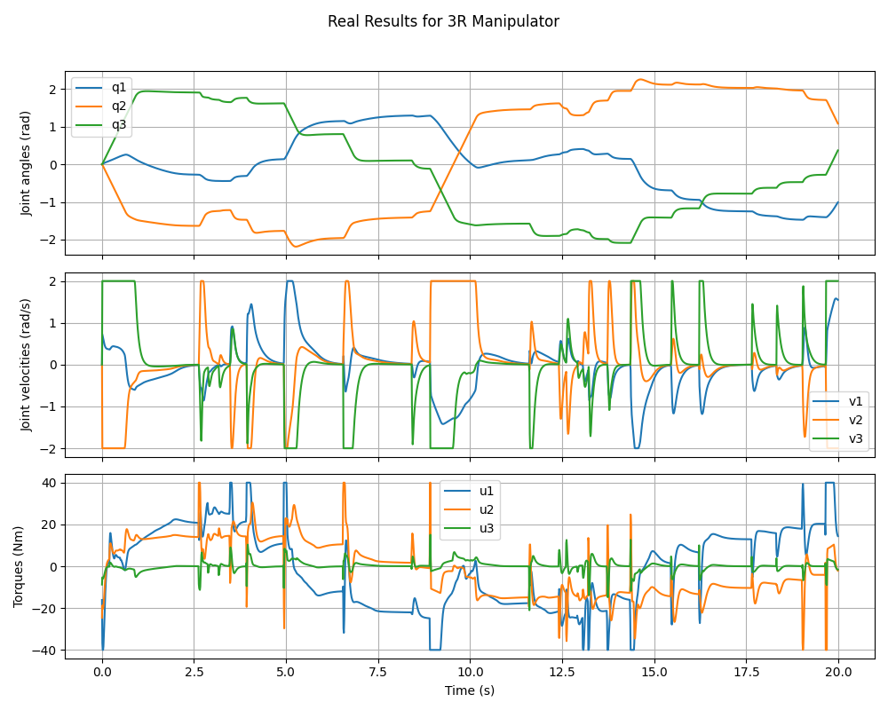

# Задание 2 — MPC с адаптацией к цели и обходом препятствий

Цель задания — построить систему управления, способную адаптировать траекторию движения под **меняющуюся цель** в реальном времени и при этом **избегать препятствий**.

---

## Реализованные компоненты

### MPC-контроллер (`mpc2simulation/mpc.py`)

- Построен на основе **Pinocchio + CasADi**
- Поддерживает:
  - ограничение на углы, скорости, ∆u, усилия
  - терминальные и трекинг-штрафы
  - ограничение на высоту звеньев (`z ≥ 0`)
  - обход препятствий (через расстояние до центров препятствий)
- Функция `enable_obstacle_avoid(...)` включает учёт препятствий

**Вместо пересчёта траектории в фоне** реализован **адаптивный MPC**, который пересчитывает оптимальное управление на каждом шаге, в зависимости от текущей цели. Такой подход называется, вроде как, ***Receding Horizon Control (RHC)* с онлайн-обновлением цели.**

### Симулятор MuJoCo (`mpc2simulation/mj_simulator_planar.py`)

- Запускает симуляцию в MuJoCo
- Задание целевой точки через `mocap`-тело (`target`) прямо во время симуляции
- Поддержка логов в виде видео симуляции и графиков движения манипулятора

---

## Технические особенности

- Реализовано только для **планарного 3R манипулятора**
- Логика применима и к UR10 — реализация возможна позднее
- **Обход препятствий** реализован как расстояние между концами звеньев и центрами препятствий. То есть, возможны ситуации, когда звенья могут касаться препятствий "боками". Это можно доработать, вычисляя несколько промежуточных точек вдоль звена (умнее ничего пока не придумал, реализую позднее)

---

## Как запустить

```bash
cd second_task
python planar_with_obstacles.py
```

---

## Примеры результатов

### Планарный 3R манипулятор с препятствиями

#### 🔹 Реальное исполнение



#### 🔹 Видео


---

## Возможное расширение через ROS2

- Ноды для запуска основного кода.
- Публикация цели от внешней ROS-ноды (например, навигационного модуля).
- Реализация ROS2 `service` для включения/выключения/добавления препятствий.
- Публикация траектории в `JointTrajectory`.
- Визуализация в `Rviz` и Gazebo (Ignition).